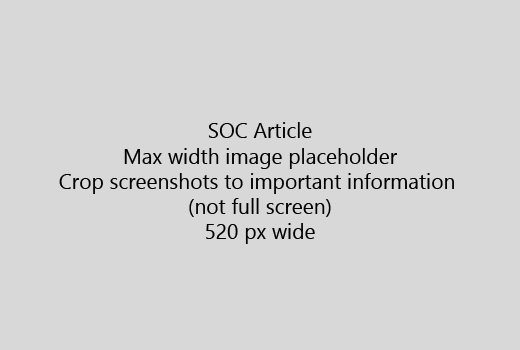

启动很短的简介 （1 句子） 与您的文章。将自己放置读者就地-为何此处是它们？他们应该怎么做？ 
  
1. 获取直线快速步骤来完成任务的列表。
    
    如果您需要介绍的概念，或拥有执行必备步骤，添加下面的步骤随时随地在需要它，并[链接](https://support.office.com/article/f37e7984-cf03-4fde-92d3-82970d7e241b.aspx)到的概念或步骤的快速摘要。 
    
2. 保留过程短-最好 5 或更少的步骤，不能超过 8。
    
3. 使用用户界面元素的**Ui 样式**或人员需要输入文本。 
    
4. 使用动词选择、 选择，或输入作为操作，并设置其格式菜单为**菜单** \> **命令**。
    
5. （如果 UI 硬查找，或者它已完成任务所需），或者，添加上下文的屏幕快照。
    
    最大宽度： 520 像素。使用标准的主题，不显示任何个人信息，且裁剪显示仅新增相关。 
    
    
  
如果您想要添加视频或屏幕截图、 使用两列网格和左边和视频中的步骤或屏幕截图中右-请参阅[步骤和视频网格示例](https://support.office.com/article/14ce8e82-efa0-47f5-bb84-94f078db3dae.aspx)。 
  
目标为某篇文章不多于 500 个单词。
  
# 示例文章

[更改我的照片](https://support.office.com/article/555376e0-1fca-49ba-8434-307a0525c767.aspx)
  

