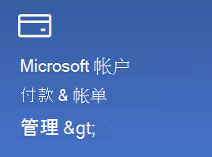

# 更改我的 Microsoft 帐户信息

转到 [https://account.microsoft.com](https://account.microsoft.com/)，如有必要，请登录。 执行此操作后，会进入你的帐户仪表板。  

**编辑我的姓名和个人信息**

1. 在帐户仪表板上你的帐户图片和姓名旁边，单击“**更多操作”>“编辑个人资料**”。
2. 在“**编辑个人资料**”页面上，使用提供的链接更改个人资料图片、姓名、出生日期、位置和显示语言首选项。 请注意你的 Xbox 或 Skype 帐户配置文件的链接，你可以在其中更改特定于这些帐户的详细信息。

**管理电子邮件地址和电话号码**

Microsoft 帐户具有一个或多个与之相关联的电子邮件地址或电话号码，称为“别名”。 要管理它们，请执行以下操作：

1. 在帐户仪表板上你的帐户图片和姓名旁边，单击“**更多操作”>“编辑个人资料**”。
2. 在“**编辑个人资料**”页面上，单击“**管理你登录 Microsoft 的方式**”。 
3. 你将看到一个帐户别名列表，并且你可以管理该列表，包括添加和删除电子邮件地址和电话号码。 在这里，你还可以选择可用于登录帐户的别名，以及将被视为“主要”的别名，这些别名将显示在 Windows 10 设备上。

**管理付款方式以及帐单的名称和地址** 

1. 在帐户仪表板上你的帐户图片和姓名旁边，单击“**更多操作”>“编辑个人资料**”。
2. 在“**付款和帐单**”下，单击“**管理**”。

    

3. 可在此处添加、编辑和删除付款方式及其关联的帐单邮寄地址。 
