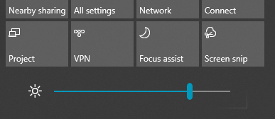

# 在 Windows 10 中更改屏幕亮度Change screen brightness in Windows 10

如果你的 Windows 10 比版本 1903 新，则它在操作中心中有一个 **亮度滑块**。If your Windows 10 is newer than version 1903, it has a **Brightness slider** in the action center. 若要打开操作中心，请单击任务栏最右侧的“**通知**”按钮，或在键盘上按 **Windows 徽标键 + A**。To open the action center, click the **Notification** button at the rightmost side of your taskbar, or press **Windows home + A** on your keyboard.

如果你的 Windows 10 是较早版本，则可通过转至“**[设置”>“系统”>“显示](ms-settings:display?activationSource=GetHelp)**”来查找亮度滑块。If your Windows 10 is an earlier version, you can find the brightness slider by going to **[Settings > System > Display](ms-settings:display?activationSource=GetHelp)**.

**注意**：**Notes**:

- 在具有外部显示器的台式电脑上，可能看不到“更改内置显示器的亮度”滑块。You might not see the Change brightness for the built-in display slider on desktop PCs that have an external monitor. 若要更改外部显示器的亮度，请使用显示器上的控件。To change the brightness of an external monitor, use the controls on the monitor.
- 如果没有台式电脑，并且滑块未显示或正常工作，请尝试更新显示驱动程序。If you don't have a desktop PC and the slider doesn't appear or work, try updating the display driver. 在任务栏的搜索框中，键入 **设备管理器**，然后从结果列表中选择“**设备管理器**”。In the search box on the taskbar, type **Device Manager**, and then select **Device Manager** from the list of results. 在 **设备管理器** 中，选择“**显示适配器**”，然后选择显示适配器。In **Device Manager**, select **Display adapters**, then select the display adapter. 按住（或右键单击）显示适配器名称，单击“**更新驱动程序**”；然后按照说明进行操作。Press and hold (or right-click) the display adapter name and click **Update driver**; then follow the instructions.
