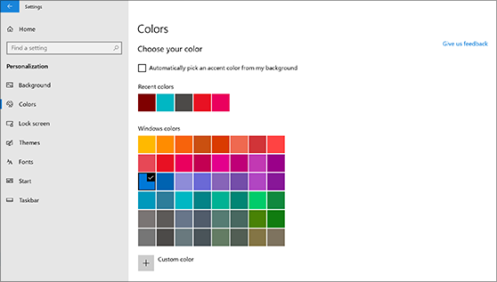
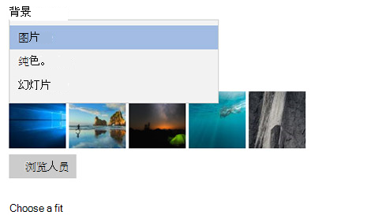

# 更改桌面背景和颜色

若要更改你的颜色设置，请转到 "**开始** > **设置** > **个性化** > **颜色**"，然后选择自己的颜色或让 Windows 从你的背景中提取强调文字颜色。

若要更改您的桌面背景，请转到 "**开始** > **设置** > **个性化** > **背景**"，然后选择图片、纯色或创建图片幻灯片。 

是否需要更多桌面背景和颜色？ 请访问[Microsoft Store](https://www.microsoft.com/store/collections/windowsthemes)以从几十个免费主题中进行选择。
