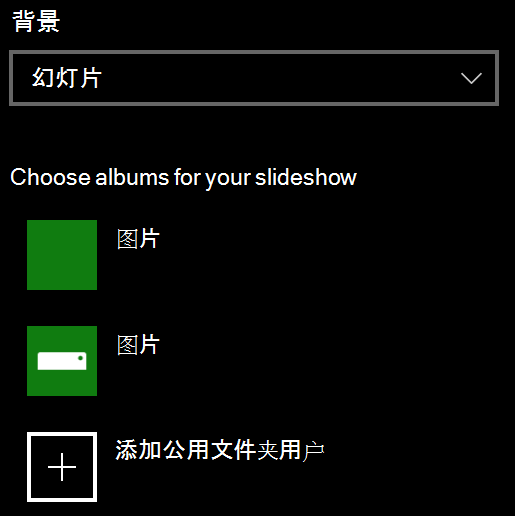

# 更改锁屏界面背景Change your lock screen background

- 转到设置  >  **个性化**  >  **锁屏界面**。Go to **Settings** > **Personalization** > **Lock screen**. 或者单击或点击 [此处](ms-settings:lockscreen?activationSource=GetHelp)。Or click or tap [here](ms-settings:lockscreen?activationSource=GetHelp).

- 若要设置自定义背景图片 **，请从**"背景"下拉列表中选择"图片"，然后选择或 **"浏览**"到图片。To set a custom background picture, select **Picture** from the **Background** drop-down list, and choose or **Browse** to the picture.

  

- 若要设置自定义图片的幻灯片放映，请从"背景"下拉列表中选择"幻灯片"，然后选择相册或添加包含幻灯片图片的文件夹。To set up a slideshow of custom pictures, select **Slideshow** from the **Background** drop-down list, and choose an album or add a folder that contains the pictures for the slideshow.

  
