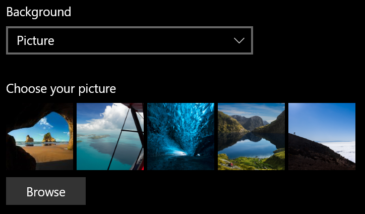

# 更改锁屏页面背景

- 转到 "**设置** > **个性化** > **锁屏" 屏幕**。 或者单击或点击[此处](ms-settings:lockscreen?activationSource=GetHelp)。

- 若要设置自定义背景图片，请从 "**背景**" 下拉列表中选择 "**图片**"，然后选择或**浏览**到图片。

  

- 若要设置自定义图片的幻灯片，请从 "**背景**" 下拉列表中选择 "**幻灯片**"，然后选择一个相册或添加包含幻灯片图片的文件夹。

  
