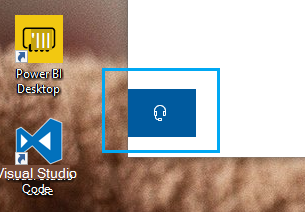

# 单击 "耳机" 按钮，与我们联系

如果你想要联系 Microsoft 支持部门，请单击此应用左下角的 **联系我们** 。 在弹出窗口中，在选择您的产品和问题类别后，系统会向正确的支持渠道提供指导。

即使已启动联系我们会话，也可以继续与应用程序的其余部分交互。 通过单击应用程序内的任何其他位置，可以临时最大限度地减少 "与我们联系" 面板。 若要返回到同一会话，只需 **再次单击 "与我们联系"** 。
