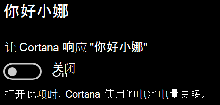

# Cortana 无法与我交谈或听不到我的声音Cortana doesn’t talk to me or can’t hear me

如果你尝试使用“你好小娜”功能（利用它，无需选择任务栏上的 Cortana 按钮或 Cortana 面板中的麦克风按钮就可与 Cortana 交谈），请确认已启用该功能：If you are trying to use the "Hey Cortana" feature, which allows you to talk to Cortana without selecting the Cortana button on the taskbar or the microphone button in the Cortana panel, confirm that the feature is enabled:

1. 转到“**开始**”，然后选择“**[设置”>“Cortana](ms-settings:cortana?activationSource=GetHelp)**”。Go to **Start**, then select **[Settings > Cortana](ms-settings:cortana?activationSource=GetHelp)**.
2. 在“**你好小娜**”下，将“**让 Cortana (小娜)响应“你好小娜”**”切换到“**打开**”。Under **Hey Cortana**, switch the **Let Cortana respond to "Hey Cortana"** toggle to **On**.

**你的隐私设置是否会阻止 Cortana 听到你的声音？****Are your privacy settings preventing Cortana from hearing you?**

你的隐私设置可能会阻止 Cortana 响应你的声音。Your privacy settings can prevent Cortana from responding to your voice.
- 检查以确保打开在线语音识别：Check to make sure Online Speech recognition is turned on:
    - 转到“**开始**”，然后单击“**[设置”>“隐私”>“语音](ms-settings:privacy-speech?activationSource=GetHelp)**”。Go to **Start**, then click **[Settings > Privacy > Speech](ms-settings:privacy-speech?activationSource=GetHelp)**.
    - 在“**在线语音识别**”下，将设置切换到“**打开**”。Under **Online speech recognition**, switch the setting to **On**.
- 检查以确保 Cortana 有权访问你的麦克风。Check to make sure Cortana has permission to access your microphone. 
    - 转到“开始”，然后单击“**[设置”>“隐私”>“麦克风](ms-settings:privacy-microphone?activationSource=GetHelp)**”。Go to Start, then click **[Settings > Privacy > Microphone](ms-settings:privacy-microphone?activationSource=GetHelp)**.
    - 在“**选择哪些应用可以访问你的麦克风**”下，在应用和服务列表中查找 **Cortana**，并确保开关切换到“**打开**”。Under **Choose which apps can access your microphone**, look for **Cortana** within the list of apps and services and make sure the switch is toggled to **On**.

此外，请确保你的扬声器或麦克风正常工作，以便与 Cortana 交谈。Moreover, please also make sure that your speakers or microphones are up and working in order to talk to Cortana.
