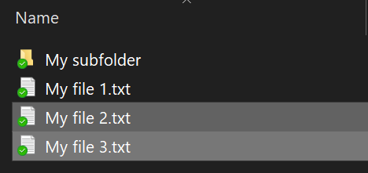
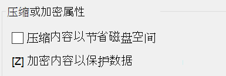

# 在 Windows 10 中加密文件或文件夹

使用 BitLocker 可对整个磁盘加密，但若要只加密单独的文件或文件夹（及其内容），请执行以下操作：

1. 在“**文件资源管理器**”中，选择要加密的文件/文件夹。 在此示例中，选择了两个文件：

    

2. 右键单击所选文件，然后单击“**属性**”。

3. 在“**属性**”窗口中，单击“**高级**”。

4. 在“**高级属性**”窗口中，选择“**加密内容以便保护数据**”复选框：

    

5. 单击“确定”。
