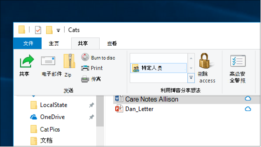
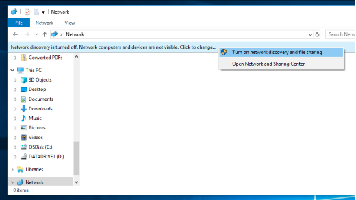

# 通过网络在 Windows 10 中共享文件

**注意**：如果你以前使用过家庭组进行文件共享，请注意，已从 Windows 10 (版本 1803) 中删除了家庭组。 您现在可以使用 Windows 10 中的内置功能共享打印机和文件。

**通过网络共享文件或文件夹**

- 在**文件资源管理器**中，选择一个文件 > 单击 "**共享位置**" 部分顶部 > 中的 "**共享**" 选项卡，单击 "**特定人员**"。

    
          
- 如果一次选择了多个文件，则可以用相同的方式共享这些文件。 它也适用于文件夹。

**查看网络上共享文件的设备**

- 在 **文件资源管理器**中，转到 " **网络**"。 如果未启用网络发现，您将看到一条错误消息 "网络发现功能已关闭 ..."

- 单击 " **网络发现" 已关闭** 标题，然后单击 " **启用网络发现和文件共享**"。

    

[阅读有关网络上的文件共享的详细信息](https://support.microsoft.com/help/4092694/windows-10-file-sharing-over-a-network)

[使用应用、OneDrive、电子邮件等共享文件](https://support.microsoft.com/help/4027674/windows-10-share-files-in-file-explorer)
