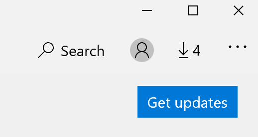

# 修复应用程序的显示语言Fix the display language of apps

在 Windows 10 中更改显示语言后，在打开某些应用程序时，可能仍会使用以前的语言。After you change the display language in Windows 10, some apps may still use the previous language when you open them. 出现这种情况的原因是，必须从存储中下载该语言的应用程序的新版本。This happens because new versions of the apps for that language must be downloaded from the Store. 若要解决此问题，您可以等待自动更新，也可以手动安装更新版本的应用程序。To fix this problem, you can either wait for the automatic update, or you can manually install the updated version of the apps.

若要手动安装更新，请打开**Microsoft Store**并单击右上角的 "**下载和更新**"。To manually install the update, open **Microsoft Store** and click **Downloads and updates** in the top right corner. 然后单击 "**获取更新**"。Then click **Get updates**. 如果更新完成后语言未更改，请尝试重新启动你的电脑。If the language is not changed after the update is complete, try restarting your PC.

若要阅读有关输入和显示语言设置的详细信息，请参阅[在 Windows 10 中管理输入和显示语言设置](https://support.microsoft.com/help/4027670/windows-10-add-and-switch-input-and-display-language-preferences)。To read more about input and display language settings, see [Manage your input and display language settings in Windows 10](https://support.microsoft.com/help/4027670/windows-10-add-and-switch-input-and-display-language-preferences).
