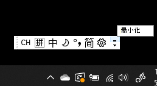
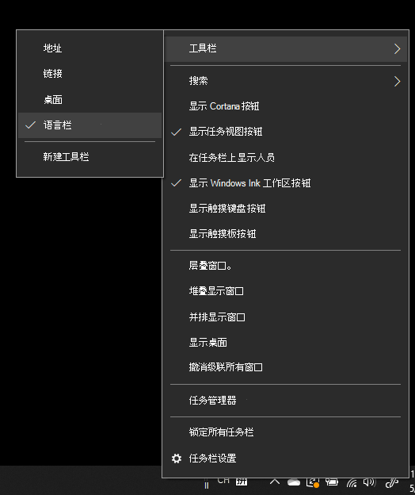
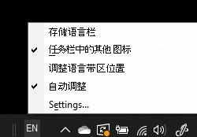

# 隐藏、显示或重置语言栏

**最小化语言栏：**

可单击语言栏右上角的“最小化”按钮。 或者，只需将语言栏拖动到任务栏即可自动将其最小化。

**弹出语言栏：**

如果不想将语言栏停靠在任务栏中，请右键单击任务栏中的任何空白区域，然后取消选中“工具栏”菜单中的“**语言栏**”选项。 就像前面的屏幕截图一样，这将使语言栏显示在任务栏外部。

**将语言栏还原为默认设置：**

右键单击工具栏中的“语言”按钮，然后在菜单中单击“**还原语言栏**”选项。 这会将其还原为默认设置。

