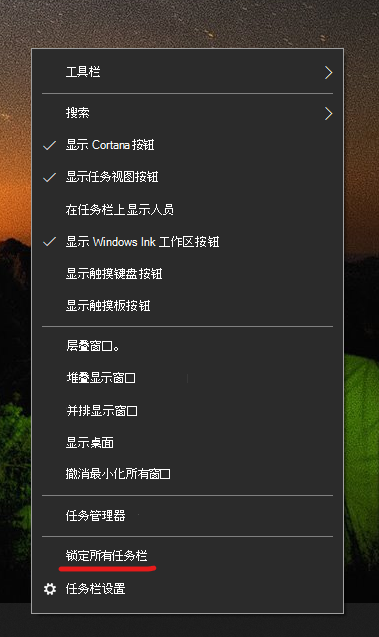

# 将任务栏移动到桌面的任一侧或顶部Move the taskbar to either side or the top of your desktop

首先，请确认任务栏已解锁。First, please confirm that the taskbar is unlocked. 若要了解是否已解锁，请右键单击任务栏上的任何空白位置，并查看“**锁定任务栏**”旁是否有复选标记。To find out whether yours is unlocked, right-click any empty space on the taskbar and see whether **Lock the taskbar** has a checkmark next to it. 如果有复选标记，则任务栏处于锁定状态，无法移动。If there is a checkmark, the taskbar is locked and cannot be moved. 单击 **锁定任务栏** 一次将解锁并删除复选标记。Clicking **Lock the taskbar** once will unlock it and remove the checkmark.

如果有多台监视器显示任务栏，则会看到“**锁定所有任务栏**”。If you have multiple monitors that display the taskbar, you will see **Lock all taskbars**.

任务栏处于解锁状态后，可按住任务栏上的任何空白位置并将其拖动到屏幕上的所需位置。Once the taskbar is unlocked, you can press and hold any empty space on the taskbar and drag it to the location you want on the screen. 你还可以通过右键单击任务栏上的任何空白位置，然后转到“**[任务栏设置](ms-settings:taskbar?activationSource=GetHelp)” > “屏幕**上的任务栏位置”来执行此操作。You can also do so by right-clicking on any empty space on the taskbar and go to **[Taskbar settings](ms-settings:taskbar?activationSource=GetHelp) > Taskbar location on screen**.
