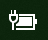

# Windows 10 中缺少电源或电池图标

如果你的 Windows 10 设备装有电池（例如，笔记本电脑或平板电脑或者通过 USB 连接到 UPS 的电脑），则通常会在任务栏上的时钟附近显示电源/电池图标，例如：

如果看不到此图标，则它可能处于隐藏状态：

1. 转到“**[设置”>“个性化”>“任务栏](ms-settings:taskbar?activationSource=GetHelp)**”。

2. 在通知区域中，单击“**选择在任务栏上显示哪些图标**”。

3. 然后在列表中查找“**电源**”项，并将其设置切换为“**打开**”。

    

**疑难解答**

如果你按照上述说明进行了操作，并且“**电源**”开关灰显或不可见，请在任务栏上的搜索框中，键入 **设备管理器**，然后在结果列表中选择“**设备管理器**”。 在“**电池**”下，右键单击设备的电池，单击“**禁用**”，然后单击“**是**”。 稍等几秒钟，右键单击电池，然后单击“**启用**”。 然后重新启动设备。

如果你按照上述说明进行了操作，但电池图标未显示在任务栏上，请在任务栏上的搜索框中键入 **任务管理器**，然后在结果列表中单击“**任务管理器**”。 在“**进程**”选项卡的“**名称**”下，右键单击 **资源管理器**，然后单击“**重新启动**”。
