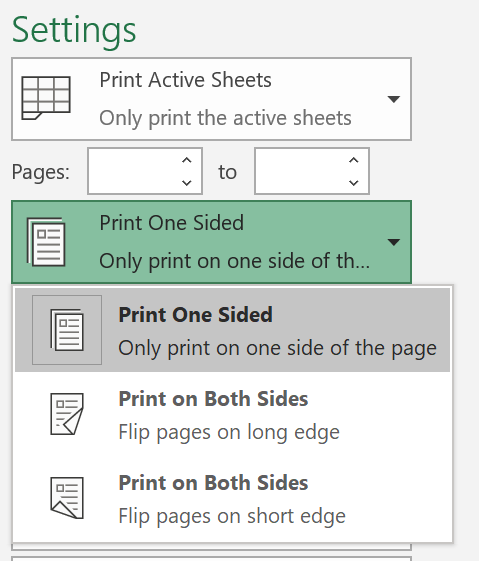
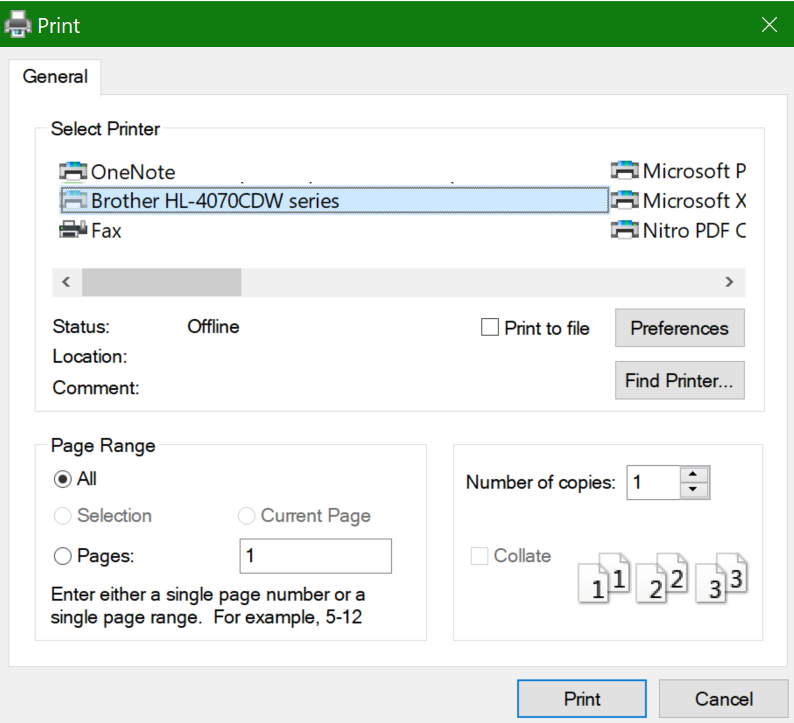

# 在纸张的两面上打印（双面打印）Printing on both sides of paper (duplex printing)

**打印机是否支持双面打印？****Is my printer capable of duplex printing?**

打印机的功能摘要或手册应告知你它是否能够在纸张的两面进行打印，也称为“双面打印”。Your printer’s feature summary or manual should tell you whether it is capable of printing on both sides of the paper, also known as “duplex printing.” 如果你拥有 Microsoft Office，另一种查找方法是打开 Office 应用（如 Word 或Excel），转到“**文件”>“打印**”，确保选择了正确的打印机，然后在“设置”部分中查找该功能。If you have Microsoft Office, another way to find out is by opening an Office app like Word or Excel, going to **File > Print**, making sure the right printer is selected, and looking for the capability in the Settings section. 例如：For example: 

**Microsoft Office 中的双面打印****Duplex printing in Microsoft Office**

如果你的打印机支持双面打印，当在 Office 应用中转到“**文件”>“打印**”时，你将看到“双面打印”选项，如上面的示例所示。If your printer is capable of printing on both sides, when you go to **File > Print** in the Office app, you will see an option to “Print on Both Sides,” as shown in the example above.  选择所需的双面打印类型（“长边翻转”或“短边翻转”），然后单击“**打印**”以开始打印输出。Select the type of duplex printing you want (flip on long edge, or flip on short edge), and click **Print** to start the printout.

**任何应用程序中的双面打印****Duplex printing from any application**

在许多应用中，当你进行打印时，将看到如下所示的常规打印对话框：In many apps when you print you will see a general print dialog that looks like this: 

确保选择正确的打印机，然后单击“**首选项**”打开打印机首选项窗口。Make sure the right printer is selected, then click **Preferences** to open the printer preferences window. 如果打印机支持双面打印，则该窗口中将显示可对当前打印作业启用此功能的功能。If the printer is capable of duplex printing, the ability to enable this for the current print job will show in that window.
