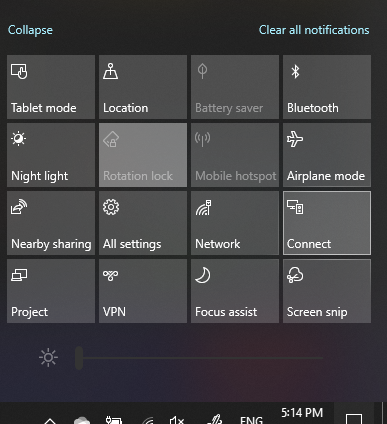

# 投影到电脑

在目标设备（投影目标）上，搜索“投影设置”以打开“**投影到这台电脑**”的“设置”页面。然后，请确保：
- “当你说没问题时，某些 Windows 和 Android 设备可以投影到这台电脑上”下拉菜单设置为“**始终关闭**”。
- “要求投影到这台电脑”下拉菜单设置为“**每次需要连接时**”。
- “需要 PIN 才能进行配对”下拉菜单设置为“**从不**”。

在目标设备上，通过访问“**开始**”并搜索“连接”来启动 **连接** 应用。

然后，在你尝试投影的源设备上：

1. 按 **Windows 徽标键 + A** 打开操作中心。
2. 单击“**连接**”。
3. 单击要将屏幕投影到的设备。

完成上述步骤后，目标设备应该显示源设备的屏幕，就像它是辅助监视器一样。
