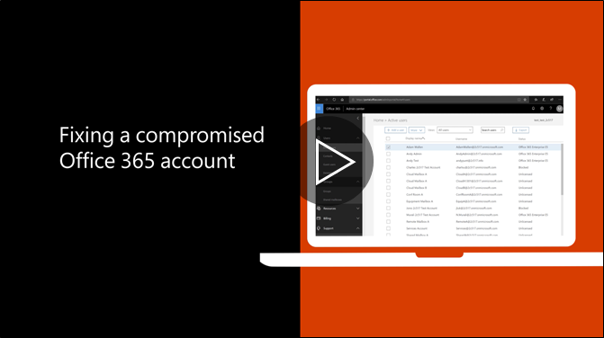

# 建议的步骤，才能如果帐户受到威胁Recommended steps to take if an account is compromised

  
1. 立即[重置用户的密码](https://support.office.com/article/7a5d073b-7fae-4aa5-8f96-9ecd041aba9c)。为最终用户不能通过电子邮件的新密码。[Reset the user's password](https://support.office.com/article/7a5d073b-7fae-4aa5-8f96-9ecd041aba9c) immediately. Do not communicate the new password through email to the end user. 
    
2. 删除任何可疑[转发地址](https://support.office.com/article/ab5eb117-0f22-4fa7-a662-3a6bdb0add74)的邮箱级别设置。Remove any suspicious [forwarding addresses](https://support.office.com/article/ab5eb117-0f22-4fa7-a662-3a6bdb0add74) set at the mailbox level. 
    
3. 删除邮箱中设置的任何可疑[收件箱规则](https://support.office.com/article/1433E3A0-7FB0-4999-B536-50E05CB67FED)。Remove any suspicious [inbox rules](https://support.office.com/article/1433E3A0-7FB0-4999-B536-50E05CB67FED) set within the mailbox. 
    
4. 如果用户阻止发送电子邮件，[请转到受限用户解除锁定该帐户](https://protection.office.com/?hash=/restrictedusers)。完成后，用户应该能够继续小时内发送邮件。If the user is blocked from sending email, [go to the Restricted Users to unblock the account](https://protection.office.com/?hash=/restrictedusers). Once done, the user should be able to resume sending messages within 1 hour.
    
5. 删除的用户帐户从任何[管理角色组](https://support.office.com/article/eac4d046-1afd-4f1a-85fc-8219c79e1504)中，直到您确信帐户不再泄漏。Remove the user account from any [administrative role groups](https://support.office.com/article/eac4d046-1afd-4f1a-85fc-8219c79e1504) until you are confident that the account is no longer compromised. 
    
为了将来减少可能存在的数据泄露或受到攻击的帐户，我们建议阅读我们的[Office 365 安全性最佳实践文章](https://support.office.com/article/9295e396-e53d-49b9-ae9b-0b5828cdedc3)。To minimize the potential of a data breach or a compromised account in the future, we recommend reading our [Office 365 Security best practices article](https://support.office.com/article/9295e396-e53d-49b9-ae9b-0b5828cdedc3).
  

