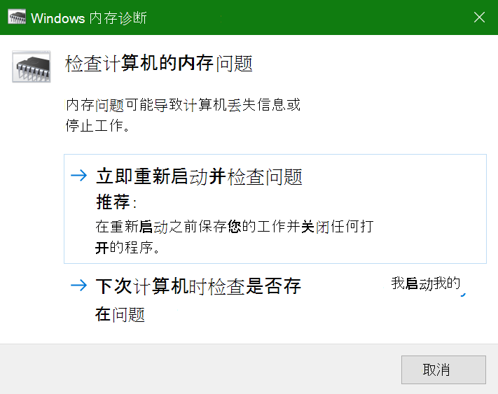

# 在 Windows 10 中运行 Windows 内存诊断

如果电脑上的 Windows 和应用程序崩溃、冻结或操作方式不稳定，则可能是电脑内存 (RAM) 有问题。 可运行 Windows 内存诊断来检查电脑 RAM 的问题。

在任务栏上的搜索框中，键入 **内存诊断**，然后选择“**Windows 内存诊断**”。 

要运行诊断，需要重启电脑。可选择立即重启（请先保存你的工作，然后关闭打开的文档和电子邮件），或安排在下次重启电脑时自动运行诊断：

电脑重启时，**Windows 内存诊断工具** 将自动运行。 运行诊断时将显示状态和进度，你可以选择通过点击键盘上的 **ESC** 键来取消诊断。

诊断完成后，Windows 将正常启动。
重启后显示桌面时，将立即显示一则通知（任务栏上的 **操作中心** 图标旁边），指示是否发现了任何内存错误。 例如：

这是操作中心图标：  

和示例通知： 

如果错过了通知，可以选择任务栏上的 **操作中心** 图标，以显示 **操作中心** 并查看可滚动的通知列表。

若要查看详细信息，请在任务栏上的搜索框中键入 **事件**，然后选择“**事件查看器**”。 在 **事件查看器** 的左侧窗格中，导航到“**Windows 日志 > 系统**”。 在右侧窗格中，向下搜寻列表的“**源**”列，直至看到带有源值 **MemoryDiagnostics** 的事件。 突出显示每个此类事件，并在列表下方“**常规**”选项卡下的框中查看结果信息。
