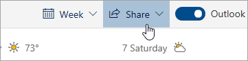

# 使用 Outlook 网页版进行共享Sharing with Outlook on the web

从日历中，在页面顶部的工具栏上，选择“ **共享**”，然后选择要共享的日历。From your Calendar, on the toolbar at the top of the page, select **Share**, and choose the calendar you want to share.

    

**注意**：不能共享其他人拥有的日历。**Note**: You can't share calendars owned by other people.

- 输入想要与之共享日历的用户的姓名或电子邮件地址。Enter the name or email address of the person you want to share your calendar with.
- 选择希望此人使用日历的方式：Choose how you want the person to use your calendar:
    - “**可查看我的繁忙时间**” 让他们看到你何时处于忙碌状态，但不包括事件位置等详细信息。**Can view when I'm busy** lets them see when you're busy but doesn't include details like the event location.
    - “**可查看标题和位置**” 让他们看到你何时处于忙碌状态以及事件标题和位置。**Can view titles and locations** lets them see when you're busy, as well as the title and location of events.
    - “**可查看全部详细信息**” 让他们看到你的事件的所有详细信息。**Can view all details** lets them see all the details of your events.
    - “**可编辑**” 让他们编辑你的日历。**Can edit** lets them edit your calendar.
    - “**委托**” 让他们编辑你的日历并与他人共享。**Delegate** lets them edit your calendar and share it with others.
- 选择“ **共享**”。Select **Share**.
