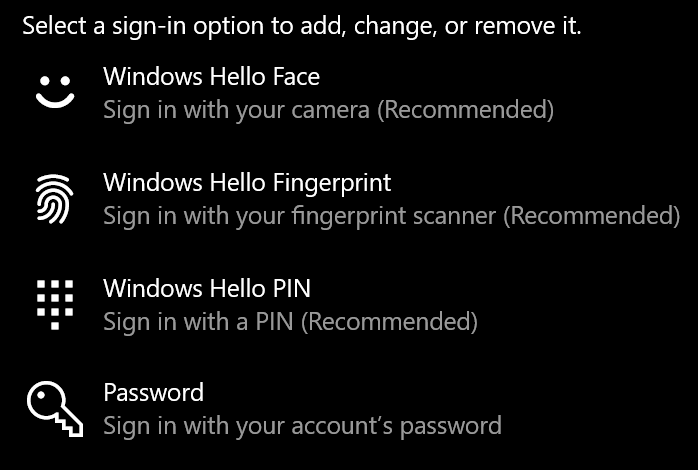
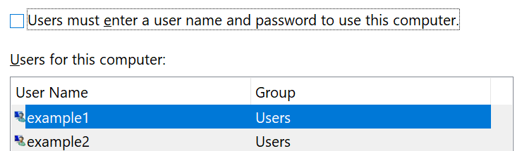

# 登录到 Windows 10，不使用密码Sign-in to Windows 10 without using a password

为了避免在 Windows 启动时必须键入密码，我们建议使用 Windows Hello 安全登录选项之一，如 PIN、面孔识别或指纹（如果可用）。To avoid having to type a password at Windows startup, we recommend you use one of the Windows Hello secure sign-in options, like a PIN, face recognition, or fingerprint, if available. 如果确实要禁用安全登录，请参阅下面的 "自动登录到 Windows 10" 说明。If you really want to disable secure sign-in, see the "Automatically sign in to Windows 10" instructions below.

**保护帐户密码的 Windows Hello 备选方案****Secure Windows Hello alternatives to the account password**

转[到 "](ms-settings:signinoptions?activationSource=GetHelp) **设置" > 帐户 > 登录选项**" (或单击") "。Go to **Settings  > Accounts > Sign-in options** (or click [here](ms-settings:signinoptions?activationSource=GetHelp)). 将列出可用的登录选项。Available sign-in options will be listed. 例如：For example:

单击或点击其中一个选项来对其进行配置。Click or tap one of the options to configure it. 下次启动或解锁 Windows 时，您将能够使用新选项而不是密码。Next time you start or unlock Windows, you will be able to use the new option instead of a password. 

**自动登录到 Windows 10****Automatically sign-in to Windows 10**

**注意**：自动登录非常方便，但会带来安全风险，尤其是当多人可以访问你的电脑时。**Note**: Automatic sign-in is convenient, but introduces a security risk, especially if your PC is accessible by multiple people. 

1. 单击或点击任务栏中的 " **开始** " 按钮。Click or tap the **Start** button in the Taskbar.

2. 键入 **netplwiz** ，然后按 Enter 键打开 "用户帐户" 窗口。Type **netplwiz** and hit the Enter key to open the User Accounts window.

3. 在 " **用户帐户**" 中，单击 Windows 启动时要自动登录的帐户。In **User Accounts**, click the account you want to automatically sign in to when Windows starts.

4. 取消选中 "用户必须输入用户名和密码才能使用此计算机" 复选框。Uncheck the "Users must enter a user name and password to use this computer" checkbox.

    

5. 单击\*\*\*\*“确定”。Click **OK**. 系统将要求你输入并确认你选择的帐户的密码。You will be asked to enter and confirm the password for the account you selected. 单击“确定”\*\*\*\* 完成。Click **OK** to finish. Windows 10 下次启动时，它将自动登录到您选择的帐户。Next time Windows 10 starts, it will automatically sign in to the account you selected.
