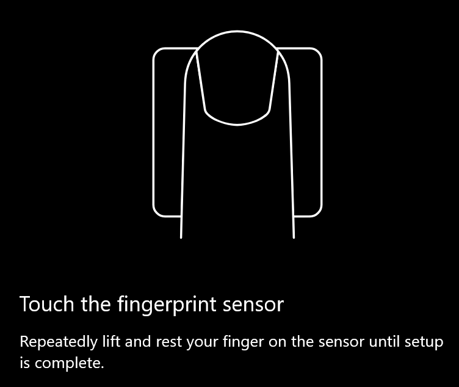
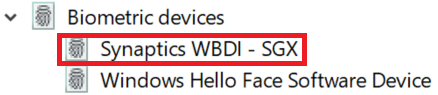

# 在 Windows 10 中使用指纹解锁选项

**启用 Windows Hello 指纹**

若要使用指纹解锁 Windows 10，你需要通过添加密码来设置 Windows Hello 指纹 (让 Windows 学习识别至少) 个手指。 

1. 转到设置 **>帐户>登录选项** ([或单击此处](ms-settings:signinoptions?activationSource=GetHelp)) 。 将列出可用的登录选项。 例如：

    

2. 单击或点击 **"Windows Hello 指纹"，** 然后单击"**设置"。** 在 Windows Hello 设置窗口中，单击 **"开始使用"。** 指纹传感器将激活，并且你将被要求将手指放在传感器上：

   

3. 按照说明进行操作，这将要求你重复扫描手指。 完成此操作后，可以选择添加你可能想要用于登录的其他手指。 下次登录 Windows 10 时，可以选择使用指纹进行登录。

**Windows Hello 指纹无法作为登录选项使用**

如果"登录选项"中未显示 Windows Hello 指纹选项，则意味着 Windows 无法识别连接到电脑的任何指纹读取器/扫描仪，或者如果电脑由工作区) 管理，则系统策略会阻止其使用 (。 疑难解答： 

1. 选择 **任务栏中的** "开始"按钮，然后搜索 **设备管理器**。

2. 单击或点击打开 **设备管理器**。

3. 在设备管理器中，通过单击其 V 号展开生物识别设备。

   

4. 指纹扫描仪应列为生物识别设备，如 Synaptics WBDI 扫描仪：

   

5. 如果未显示指纹扫描仪，并且扫描仪已集成到电脑中，请转到电脑制造商的网站。 在电脑型号的技术支持部分，搜索可安装的扫描仪的 Windows 10 驱动程序。

6. 如果扫描仪与通过 USB (连接的电脑驱动程序) ，请转到扫描仪制造商的网站，查找并安装适用于扫描仪型号的 Windows 10 设备驱动程序软件。
