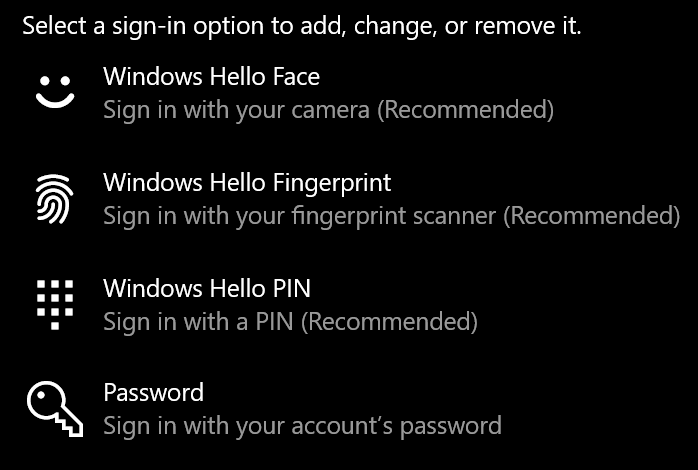

# 在 Windows 10 中使用指纹解锁选项Use fingerprint unlock option in Windows 10

**启用 Windows Hello 指纹****Enable Windows Hello Fingerprint**

若要使用指纹解锁 Windows 10，你需要通过添加密码来设置 Windows Hello 指纹 (让 Windows 学习识别至少) 个手指。To unlock Windows 10 using your fingerprint, you need to set up Windows Hello Fingerprint by adding (letting Windows learn to recognize) at least one finger. 

1. 转到设置 **>帐户>登录选项** ([或单击此处](ms-settings:signinoptions?activationSource=GetHelp)) 。Go to **Settings  > Accounts > Sign-in options** (or click [here](ms-settings:signinoptions?activationSource=GetHelp)). 将列出可用的登录选项。Available sign-in options will be listed. 例如：For example:

    

2. 单击或点击 **"Windows Hello 指纹"，** 然后单击"**设置"。**Click or tap **Windows Hello Fingerprint**, then click **Set up**. 在 Windows Hello 设置窗口中，单击 **"开始使用"。**In the Windows Hello setup window, click **Get started**. 指纹传感器将激活，并且你将被要求将手指放在传感器上：The fingerprint sensor will activate, and you'll be asked to place your finger on the sensor:

   

3. 按照说明进行操作，这将要求你重复扫描手指。Follow the instructions, which will ask you to repeatedly scan your finger. 完成此操作后，可以选择添加你可能想要用于登录的其他手指。When this is finished, you'll have the option of adding other fingers you may want to use for sign-in. 下次登录 Windows 10 时，可以选择使用指纹进行登录。Next time you sign in to Windows 10, you will have the option of using your fingerprint to do so.

**Windows Hello 指纹无法作为登录选项使用****Windows Hello Fingerprint not available as a sign-in option**

如果"登录选项"中未显示 Windows Hello 指纹选项，则意味着 Windows 无法识别连接到电脑的任何指纹读取器/扫描仪，或者如果电脑由工作区) 管理，则系统策略会阻止其使用 (。If Windows Hello Fingerprint is not shown as an option in **Sign-in options**, it means Windows is not aware of any fingerprint reader/scanner attached to your PC, or that a system policy prevents its use (if for example your PC is managed by your workplace). 疑难解答：To troubleshoot: 

1. 选择 **任务栏中的** "开始"按钮，然后搜索 **设备管理器**。Select the **Start** button in the Taskbar and search for **Device Manager**.

2. 单击或点击打开 **设备管理器**。Click or tap to open **Device Manager**.

3. 在设备管理器中，通过单击其 V 号展开生物识别设备。In Device Manager, expand Biometric devices by clicking its chevron.

   

4. 指纹扫描仪应列为生物识别设备，如 Synaptics WBDI 扫描仪：Your fingerprint scanner should be listed as a biometric device, such as the Synaptics WBDI scanner:

   

5. 如果未显示指纹扫描仪，并且扫描仪已集成到电脑中，请转到电脑制造商的网站。If your fingerprint scanner is not shown, and the scanner is integrated into your PC, go to the PC manufacturer's website. 在电脑型号的技术支持部分，搜索可安装的扫描仪的 Windows 10 驱动程序。In the technical support section for your PC model, search for a Windows 10 driver for a scanner that you can install.

6. 如果扫描仪与通过 USB (连接的电脑驱动程序) ，请转到扫描仪制造商的网站，查找并安装适用于扫描仪型号的 Windows 10 设备驱动程序软件。If the scanner is separate from the PC (attached via USB), go to the scanner manufacturer's website to find and install Windows 10 device driver software for the scanner model you have.
