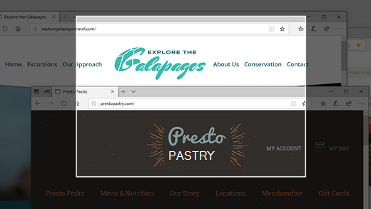
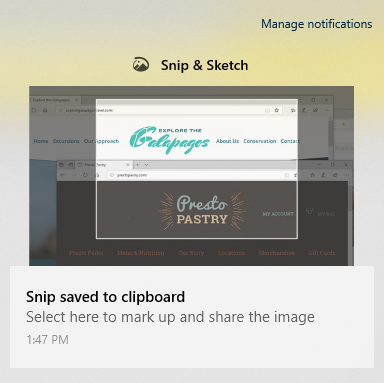

# 使用 Snip & Sketch 捕获、标记和共享图像Use Snip & Sketch to capture, mark up, and share images

屏幕草图现在称为 **Snip & Sketch**。Screen sketch is now called **Snip & Sketch**. **若要快速拍摄提示**：**To quickly take a snip**:

1. 按 **Windows 徽标键 + Shift + S。** 你将看到屏幕变暗，光标显示为十字。Press the **Windows logo key + Shift + S**. You'll see your screen darken and your cursor displayed as a cross. 

2. 选择要复制的区域边缘的某个点，然后左键单击光标。Choose a point at the edge of the area you want to copy and left-click the cursor. 

3. 移动光标以突出显示要捕获的区域。Move your cursor to highlight the area you want to capture. 你捕获的区域将显示在你的屏幕上。The area you capture will appear on your screen.

   

你剪下的图像将保存到剪贴板，准备粘贴到电子邮件或文档中。The image you snipped is saved to your clipboard, ready for pasting into an email or document. 

**如果要编辑或查看图像**：**If you want to edit or view the image**: 

- 单击任务栏最右边的通知图标;然后单击刚捕获的图片。Click the notifications icon at the far right side of the taskbar; then click the picture you have just captured. 你的 snip 将在"Snip & Sketch"应用中打开。Your snip opens in the Snip & Sketch app.

   
