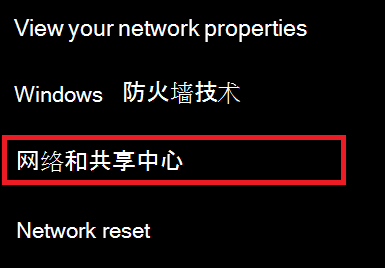
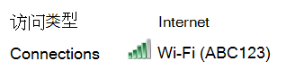
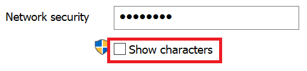

# 查看Wi-Fi Windows 10 中的网络密码View Wi-Fi network password in Windows 10

1. 确保你的 Windows 10 电脑已连接到 Wi-Fi网络。Make sure your Windows 10 PC is connected to the Wi-Fi network.

2. 转到"设置 **>网络& Internet > 状态"，或** 单击或点击此处，让我们立即 转到此处。) Go to **Settings  > Network & Internet  > Status**, or click or tap [here](ms-settings:network?activationSource=GetHelp) to let us take you there now.)

3. 单击“网络和共享中心”。Click **Network and Sharing Center**.

    

4. 在 **网络和共享中心的**"连接 **"** 旁边，你将看到无线网络的名称。In **Network and Sharing Center**, next to **Connections**, you will see the name of your wireless network. 例如，如果您的网络名为"ABC123"，您可能会看到：For example, if your network is named "ABC123," you might see:

    

    单击无线网络名称以打开"Wi-Fi状态"窗口。Click the wireless network name to open the Wi-Fi Status window. 

5. 在"Wi-Fi状态"窗口中，单击"**无线属性"，** 单击"**安全"** 选项卡，然后选中"**显示字符"。**In the Wi-Fi Status window, click **Wireless Properties**, click the **Security** tab, and check **Show characters**.

    

